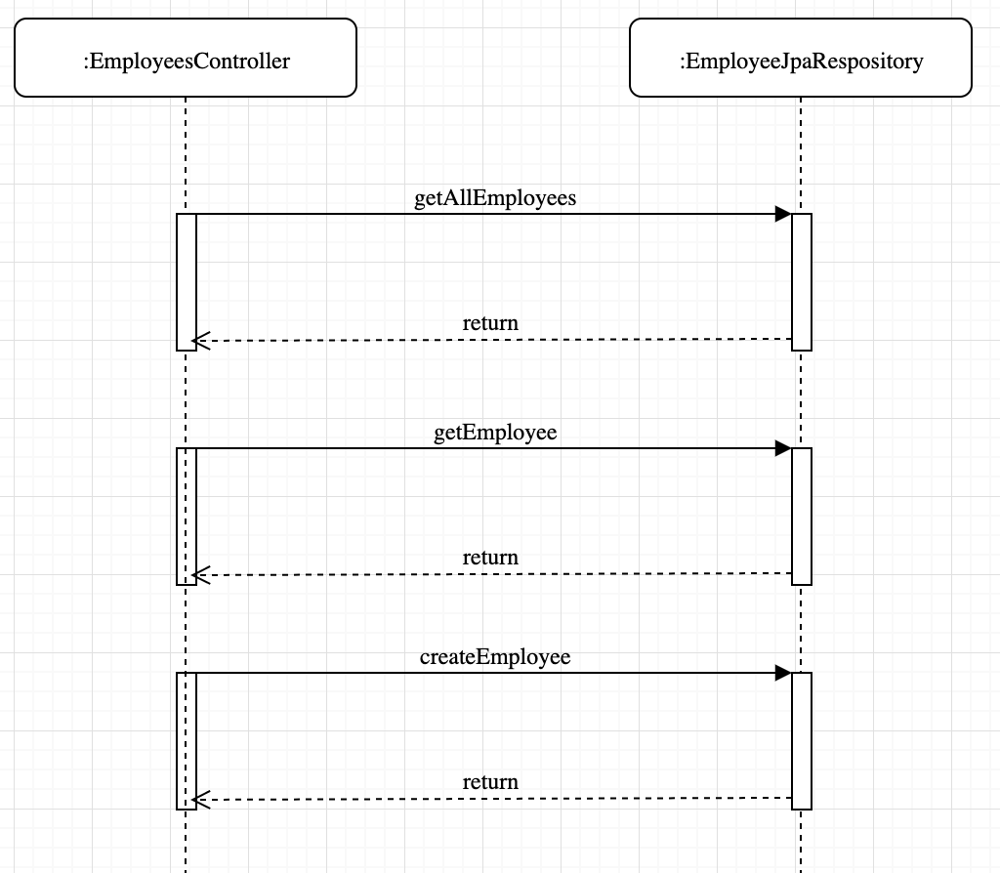

## Spring Boot REST and JPA example ##

### Getting Started ###
Initial project template using using [Spring Initializr](https://start.spring.io/)

Dependencies selected are:
* __Spring Web__: For REST endpoints
* __Spring Data JPA__: To persist data in SQL stores
* __H2 Database__: Embedded In-memory database for test
* __Spring Boot Actuator__: For monitoring metrics endpoints
* __Spring Security__: For authentication and authorization. `Security was disabled` in this project
* __Spring Boot Devtools__: For live application reloads
* __Lombok__: To reduce boilerplate code
* Other dependencies:
  * __Swagger UI__: To publish API documents
  ```
  <dependency>
       <groupId>io.springfox</groupId>
       <artifactId>springfox-swagger2</artifactId>
       <version>${swagger.version}</version>
  </dependency>
  <dependency>
       <groupId>io.springfox</groupId>
       <artifactId>springfox-swagger-ui</artifactId>
       <version>${swagger.version}</version>
  </dependency>
  ```

### Code base ###

* `SpringBootRestJpaApplication.java`: Auto-generated Spring Boot starter
* `ApplicationSecurity.java`: To disable spring security
* `SwaggerConfig.java`: To configure Swagger



### Build ###

```
cd spring-boot-rest-jpa
mvn clean install
```

### Deploy to PCF foundation ###

```
# Login
cf login -a https://api.API-DOMAIN \
  -u admin -p <password> \
  --skip-ssl-validation \
  -o playground -s apps

# Deploy application using manifest
cf push --vars-file vars-dev.yml
```
### Launch Swagger UI ###

https://boot-app-a.APP-DOMAIN/swagger-ui.html

### Test ###

```
# Create an employee
curl -X POST "https://boot-app-a.APP-DOMAIN/employees/create" \
  -H "accept: */*" -H "Content-Type: application/json" \
  -d "{ \"age\": 25, \"department\": \"Information Technology\", \"name\": \"Mohan Jo Daro\"}" -k

# Response Body
{
  "age": 25,
  "department": "Information Technology",
  "name": "Mohan Jo Daro"
}
```

```
# Get all employees
curl -X GET "https://boot-app-a.APP-DOMAIN/employees/" -H "accept: */*" -k

# Response Body
[
  {
    "id": 1,
    "name": "Mohan Jo Daro",
    "age": 25,
    "department": "Information Technology"
  },
  {
    "id": 2,
    "name": "H R Appa",
    "age": 27,
    "department": "Information Technology"
  }
]
```
